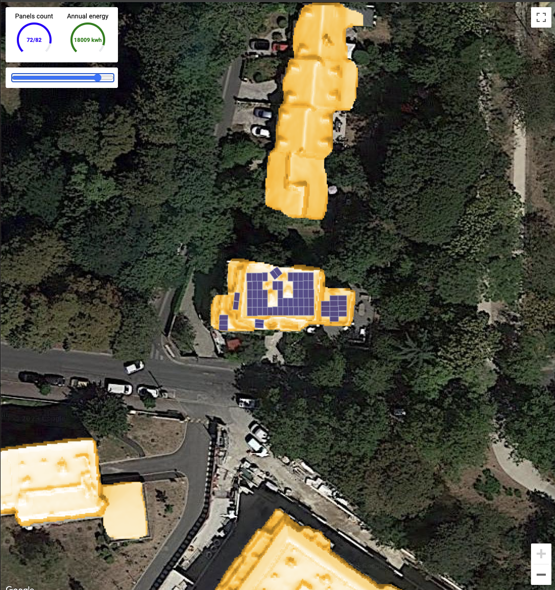

# Woolpert Solar API POC

This repo contains a simple Typescript web app that demonstrates the capabilities of Solar API.

The demo allows a user to select an address and estimate the average generated solar power based on different number of panels. The code also demonstrate how to visualize different data layers on top of the map.





## How to run 


Use GCP Console to create a new Google Map API key or find an existing one. Make sure the API Key has access to Solar API and that the API is enabled. Update the api key in `public/index.html` file. Then run:

```bash
npm install
npm run build
npm start
```


## How to create a key to use with this example

1. Go to [GMP Credentials Page](https://console.cloud.google.com/google/maps-apis/credentials) 
1. Click `CREATE CREDENTIALS` > `API KEY`
1. Update `public/index.html` with the new key you received.


## How to enable Solar API

1. Go to [GMP API List Page](https://console.cloud.google.com/google/maps-apis/api-list)
1. Find Solar API.
1. Click Enable.